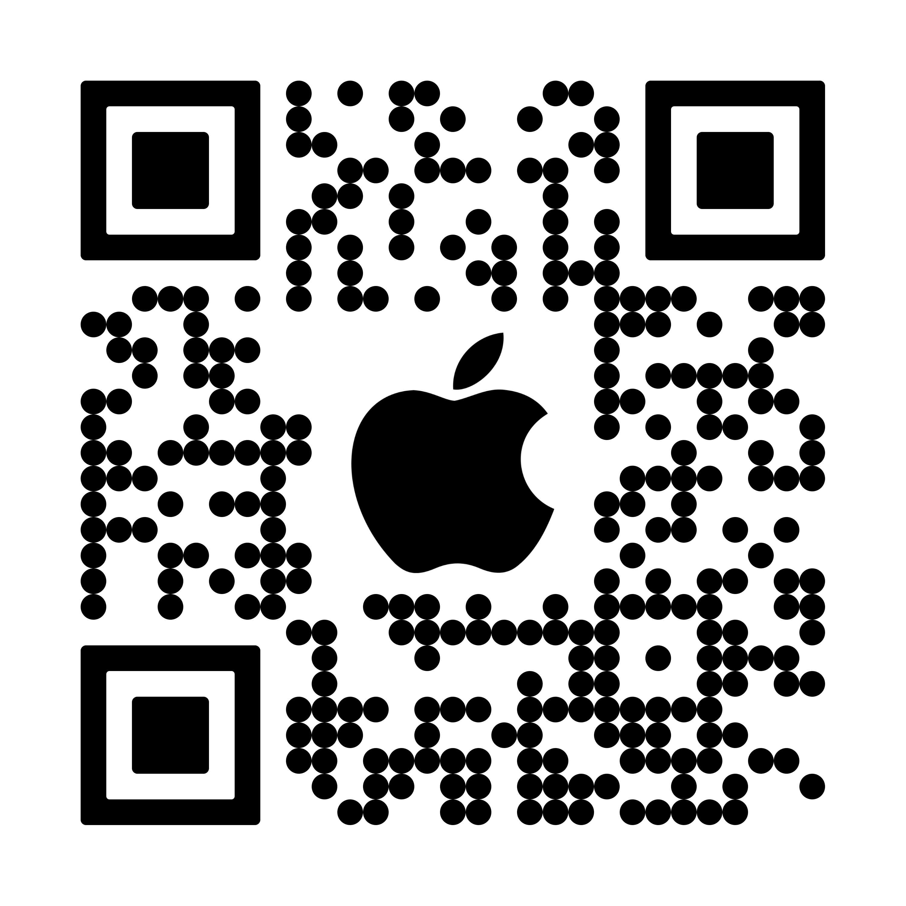

# UWr-Projekt-aplikacji-mobilnej-2

[AppStore](https://apps.apple.com/us/app/count-down-days-to-date/id1597135080)

[Privacy Policy](PrivacyPolicy.md)

[Terms & Conditions](TermsAndConditions.md)

## Descrioption

The application will have the task of calculating the number of remaining days to the
date set by the user.
The user should have the easiest possible access to a quick overview of
user should have the easiest possible access to a quick overview of their events (Widget), and an uncomplicated interface (2 views: List
events, edit event / new event).
The application will work without the need for internet access (after
download).
App for IOS systems
